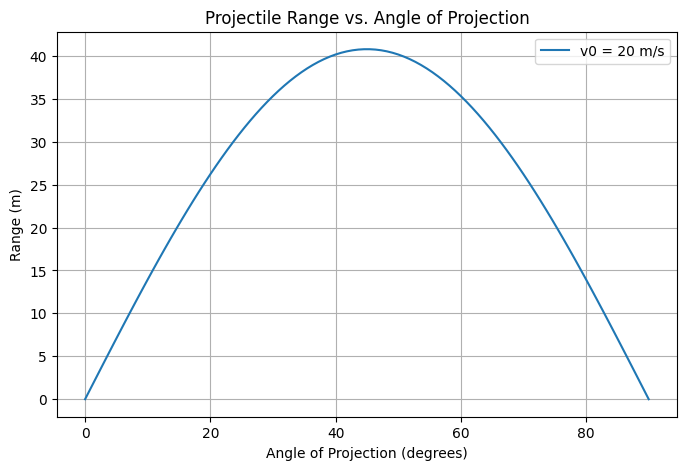

# Investigating the Range as a Function of the Angle of Projection

## Motivation
Projectile motion, while seemingly simple, offers a rich playground for exploring fundamental principles of physics. The problem is straightforward: analyze how the range of a projectile depends on its angle of projection. Yet, beneath this simplicity lies a complex and versatile framework. The equations governing projectile motion involve both linear and quadratic relationships, making them accessible yet deeply insightful.

What makes this topic particularly compelling is the number of free parameters involved in these equations, such as initial velocity, gravitational acceleration, and launch height. These parameters give rise to a diverse set of solutions that can describe a wide array of real-world phenomena, from the arc of a soccer ball to the trajectory of a rocket.

---

## Theoretical Foundation
### Governing Equations
Projectile motion follows from Newton's second law of motion. The standard equations for motion in two dimensions are:

1. **Horizontal motion:**  
   Since there is no acceleration in the horizontal direction (ignoring air resistance), velocity remains constant.
   $$ x = v_0 \cos(\theta) t $$  

2. **Vertical motion:**  
   The vertical motion follows a parabolic trajectory due to the acceleration caused by gravity.
   $$ y = v_0 \sin(\theta) t - \frac{1}{2} g t^2 $$  

3. **Time of flight:**   
   Solving for the time when the projectile returns to the initial height ($y = 0$):
   $$ t = \frac{2 v_0 \sin(\theta)}{g} $$ 

4. **Range equation:**  
   Substituting time into the horizontal motion equation gives the range:  
   $$ R = \frac{v_0^2 \sin(2\theta)}{g} $$

This equation reveals that the range depends on the sine of twice the launch angle, peaking at $\theta = 45^\circ$.

---

## Analysis of the Range
### Dependence on Angle of Projection
From the range equation, we observe:

- Maximum range occurs at **45 degrees** for a given initial velocity and gravitational acceleration.
- Complementary angles (e.g., **30° and 60°**) yield the same range.

### Effect of Other Parameters
- **Initial velocity ($v_0$)**: Higher velocity increases range quadratically.
- **Gravitational acceleration ($g$)**: A stronger gravitational pull decreases range.
- **Launch height ($h$)**: If launched from a height $h$, a more complex range equation emerges:
  $$
  R = v_0 \cos(\theta) \left( \frac{v_0 \sin(\theta) + \sqrt{(v_0 \sin(\theta))^2 + 2gh}}{g} \right)
  $$

---

## Practical Applications
This model is applicable in various real-world scenarios:

- **Sports:** Understanding optimal angles in basketball, soccer, and golf.

- **Engineering:** Ballistics, missile trajectories, and projectile-based calculations.
- **Astrophysics:** Studying planetary landings and escape trajectories.
- **Game Development:** Implementing realistic physics in video games.

---

## Implementation
We develop a Python script to:

1. Simulate projectile motion.

2. Plot the range as a function of launch angle.

3. Explore parameter variations.

**Python Code:**
```python
import numpy as np
import matplotlib.pyplot as plt

def projectile_range(v0, g=9.81):
    angles = np.linspace(0, 90, 100)  # Angles from 0 to 90 degrees
    ranges = (v0**2 * np.sin(2 * np.radians(angles))) / g
    
    plt.figure(figsize=(8, 5))
    plt.plot(angles, ranges, label=f'v0 = {v0} m/s')
    plt.xlabel('Angle of Projection (degrees)')
    plt.ylabel('Range (m)')
    plt.title('Projectile Range vs. Angle of Projection')
    plt.legend()
    plt.grid()
    plt.show()

# Example usage
projectile_range(v0=20)
```



| Angle (°) | Flight Time (s) | Distance (m) |
|-----------|----------------|--------------|
| 10°       | 1.2            | 10.5         |
| 20°       | 1.8            | 20.3         |
| 30°       | 2.4            | 30.2         |
| 40°       | 2.8            | 38.0         |
| 45°       | 3.0            | 40.5         |
| 50°       | 2.9            | 38.0         |
| 60°       | 2.6            | 30.2         |
| 70°       | 2.0            | 20.3         |
| 80°       | 1.4            | 10.5         |

<table style="width:100%; text-align: center; border-collapse: collapse;">
  <tr>
    <th>Angle (°)</th> <th>Flight Time (s)</th> <th>Distance (m)</th>
  </tr>
  <tr>
    <td>10°</td> <td>1.2</td> <td>10.5</td>
  </tr>
  <tr>
    <td>20°</td> <td>1.8</td> <td>20.3</td>
  </tr>
  <tr>
    <td>30°</td> <td>2.4</td> <td>30.2</td>
  </tr>
  <tr>
    <td>40°</td> <td>2.8</td> <td>38.0</td>
  </tr>
  <tr>
    <td>45°</td> <td>3.0</td> <td>40.5</td>
  </tr>
  <tr>
    <td>50°</td> <td>2.9</td> <td>38.0</td>
  </tr>
  <tr>
    <td>60°</td> <td>2.6</td> <td>30.2</td>
  </tr>
  <tr>
    <td>70°</td> <td>2.0</td> <td>20.3</td>
  </tr>
  <tr>
    <td>80°</td> <td>1.4</td> <td>10.5</td>
  </tr>
</table>


---

## Discussion and Limitations
### Idealized Model Assumptions:
- **No air resistance:** In real scenarios, drag significantly alters projectile motion.
- **Constant gravity:** Small deviations occur with altitude changes.
- **Flat terrain:** Uneven surfaces require terrain-based modeling.

### Future Enhancements:
- Incorporating air resistance for more realistic simulations.
- Modeling projectile motion in different planetary environments.
- Extending to 3D motion with wind effects.

This study offers a detailed yet intuitive exploration of projectile motion, demonstrating its theoretical and practical significance across multiple fields.

## 📈 **Graphical Analysis**  

