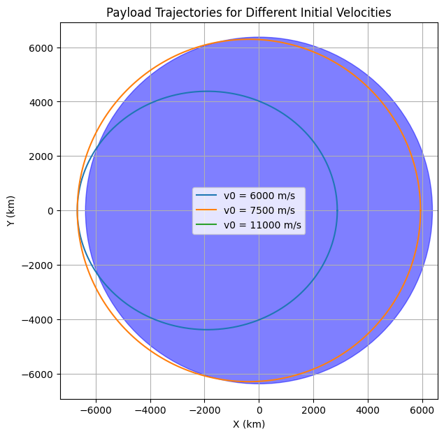
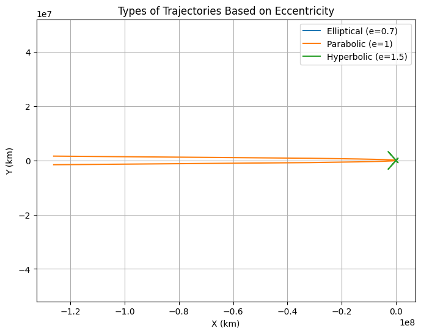
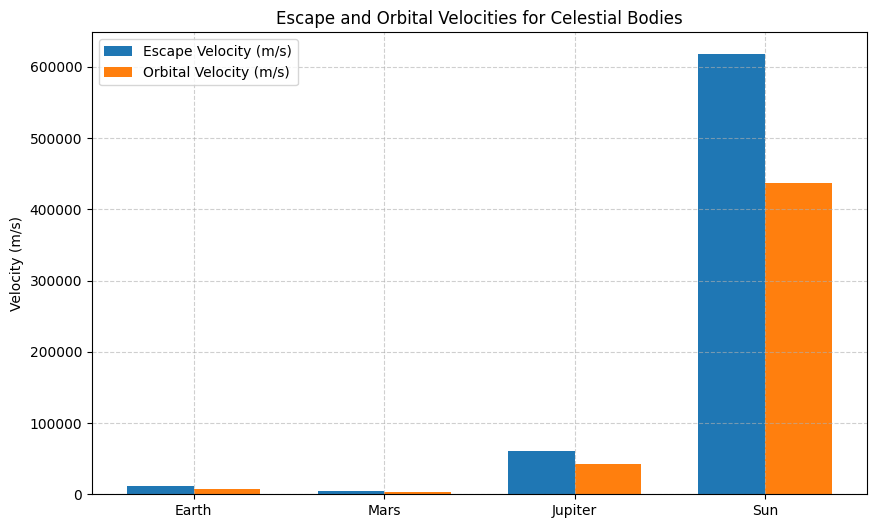
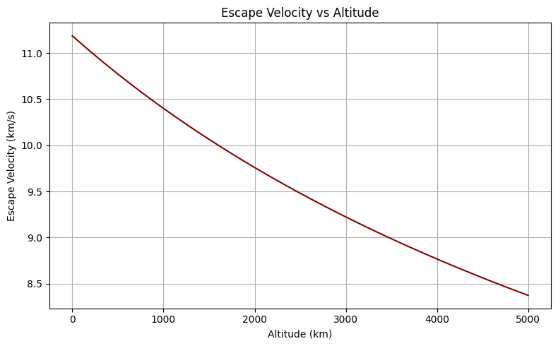
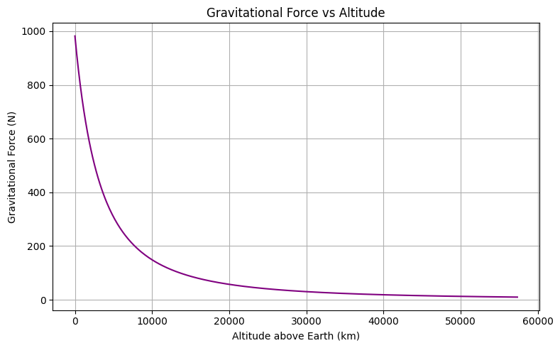
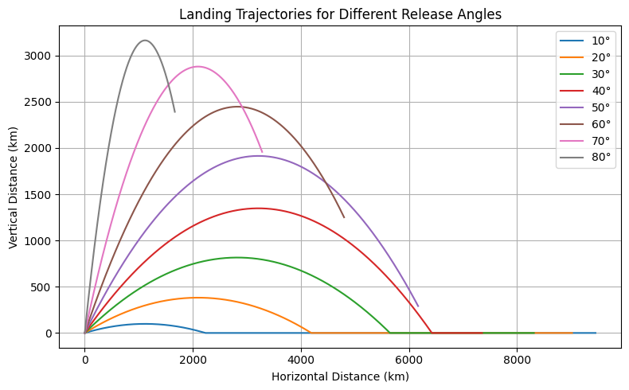

# 🛰️ Problem 3: Trajectories of a Freely Released Payload Near Earth

## 🚀 Motivation

When an object is released from a moving rocket near Earth, its trajectory is influenced by both the initial velocity and Earth's gravitational pull. This problem blends the concepts of **orbital mechanics** and **numerical simulations**. Understanding such motion is crucial for:

- Deploying payloads into orbit
- Reentry maneuvers
- Planning escape missions from Earth’s gravity

---

## 🎯 Task Overview

### 1. **Analyze Possible Trajectories**

- **Elliptical orbit**: If the object’s speed is below escape velocity and properly directed.
- **Parabolic path**: When velocity equals escape velocity.
- **Hyperbolic escape**: If speed exceeds escape velocity.
- **Sub-orbital**: If speed is insufficient to maintain orbit (returns to Earth).

### 2. **Numerical Simulation**

- Simulate payload motion with varying:
  - Initial velocities
  - Launch directions
  - Altitudes
- Implement Newton’s Law of Gravitation to calculate acceleration and path.

### 3. **Applications**
- Orbital insertion (e.g., satellites)
- Safe reentry paths
- Mission planning for interplanetary travel

---

## 📐 Theoretical Background

### Newton’s Law of Gravitation:
\[
F = G \frac{M m}{r^2}
\]

### Newton’s Second Law:
\[
F = m a \Rightarrow a = \frac{F}{m}
\]

Combined:
\[
\vec{a} = - \frac{GM}{r^2} \hat{r}
\]

Where:
- \( G = 6.67430 \times 10^{-11} \, \text{m}^3/\text{kg}/\text{s}^2 \)
- \( M = 5.972 \times 10^{24} \, \text{kg} \) (Earth’s mass)
- \( r \) is the distance from Earth’s center to the payload

---

## 🧮 Simulation Plan

- **Step 1**: Define gravitational parameters and initial conditions
- **Step 2**: Implement time integration (e.g., Euler or RK4)
- **Step 3**: Plot trajectories for:
  - Sub-orbital speed
  - Circular orbital speed
  - Escape velocity
  - Hyperbolic (greater than escape) speed

---

## 📦 Deliverables

- ✅ Python simulation code in Colab
- ✅ Visual comparison of different trajectories
- ✅ Explanation of each motion case
- ✅ Discussion on how results relate to real-world applications

---

## 📌 Notes & Considerations

- Simulations assume **2D plane** and **point-mass gravity**.
- Atmospheric drag and Earth’s rotation are ignored in the first version.
- Future extensions:
  - Include atmospheric resistance
  - Model reentry heating effects
  - Consider n-body scenarios

---
