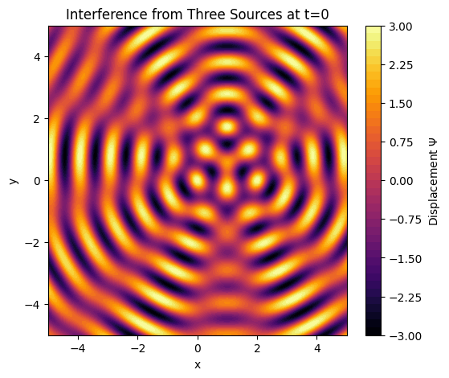

# 🌊 Problem 1: Interference Patterns on a Water Surface

## 📘 Motivation

Interference occurs when waves from different sources overlap, creating new patterns. On a water surface, this can be clearly observed when ripples from multiple point sources meet. These patterns illustrate:

- **Constructive interference**: where waves reinforce each other
- **Destructive interference**: where waves cancel out

This task helps us understand wave behavior visually and builds intuition for concepts such as phase, coherence, and superposition.

---

## 🎯 Task Overview

You will simulate and analyze **interference patterns** created by waves emitted from **point sources located at the vertices of a regular polygon**.

---

## 🧮 Wave Equation

The wave from a single source at location $\vec{r}_i$ is given by:

$$
\psi_i(\vec{r}, t) = A \cdot \cos\left(k |\vec{r} - \vec{r}_i| - \omega t + \phi\right)
$$

Where:

- $\psi_i$: displacement at point $\vec{r}$ and time $t$
- $A$: amplitude
- $k = \frac{2\pi}{\lambda}$: wave number
- $\omega = 2\pi f$: angular frequency
- $|\vec{r} - \vec{r}_i|$: distance from source to point
- $\phi$: initial phase

---

## 🧭 Steps to Follow

### 1. **Choose a Regular Polygon**
- Triangle, square, pentagon, etc.

### 2. **Position Wave Sources**
- Place point sources at the vertices of the polygon.

### 3. **Define Wave Equations**
- Use the wave formula for each source based on its position.

### 4. **Apply Superposition Principle**
$$
\Psi(\vec{r}, t) = \sum_{i=1}^{N} \psi_i(\vec{r}, t)
$$

### 5. **Visualize Interference Pattern**
- Plot surface displacement across a 2D grid.

### 6. **Analyze Constructive & Destructive Interference**
- Observe and explain bright (amplified) and dark (cancelled) regions.

---

## 💡 Assumptions

- All waves are **coherent** (same frequency, amplitude, phase relationship).
- Waves propagate on a **flat 2D plane**.
- Medium is **uniform and lossless**.

---

## 📦 Deliverables

- ✅ Python notebook (e.g., in Google Colab) with simulation code
- ✅ Graphical representations of the interference pattern
- ✅ Explanation of the physical phenomena observed
- ✅ Discussion of phase, geometry, and interference effects

---

## 📌 Notes

- Increasing the number of sources (polygon vertices) leads to more complex interference.
- You can later test with varying phase offsets or frequencies for deeper analysis.
